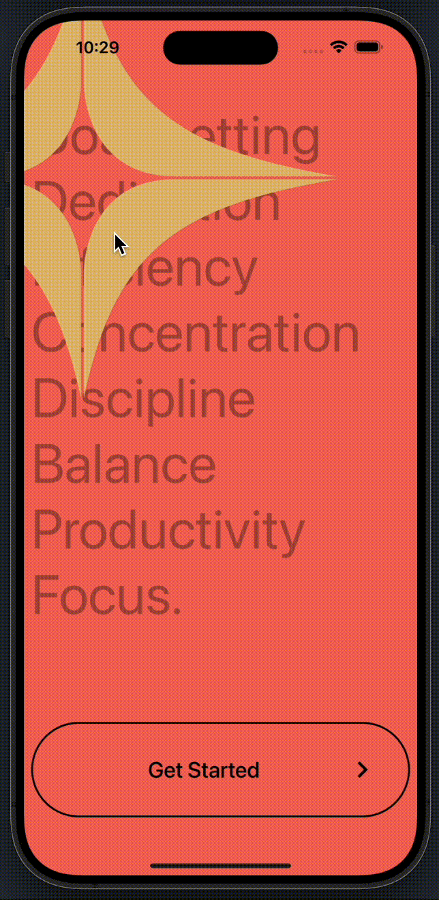
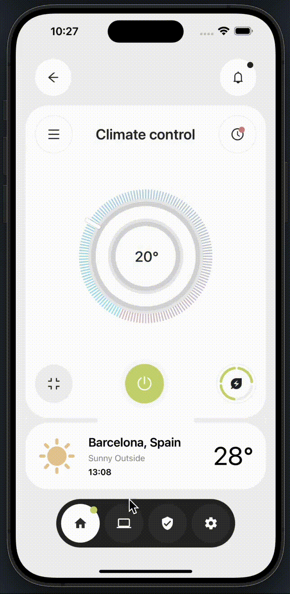

# oneDayOneSlice

<p align="middle">
  
  
  
  
  
  
</p>

## Project Description

The goal of this project is to enhance UI slicing skills using React Native. By working on this project, the aim is to improve the ability to convert design mockups into functional and visually appealing user interfaces in a React Native environment.

This project is bootstrapped using [`@react-native-community/cli`](https://github.com/react-native-community/cli).

### Disclaimer
This project is for learning purposes only. All designs, trademarks, brands, and any other content shown in this project are not owned by the developer.

## Getting Started

> **Note**: Make sure you have completed the [Set Up Your Environment](https://reactnative.dev/docs/set-up-your-environment) guide before proceeding.

### Step 1: Start Metro

First, you will need to run **Metro**, the JavaScript build tool for React Native.

To start the Metro dev server, run the following command from the root of your React Native project:

```sh
# Using npm
npm start
```

### Step 2: Build and run your app

With Metro running, open a new terminal window/pane from the root of your React Native project, and use one of the following commands to build and run your Android or iOS app:

#### Android

```sh
# Using npm
npm run android
```

#### iOS

For iOS, remember to install CocoaPods dependencies (this only needs to be run on first clone or after updating native deps).

The first time you create a new project, run the Ruby bundler to install CocoaPods itself:

```sh
bundle install
```

Then, and every time you update your native dependencies, run:

```sh
bundle exec pod install
```

For more information, please visit [CocoaPods Getting Started guide](https://guides.cocoapods.org/using/getting-started.html).

```sh
# Using npm
npm run ios
```
